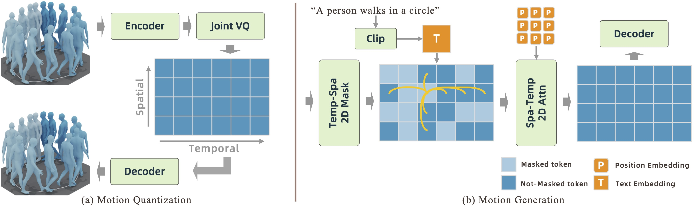
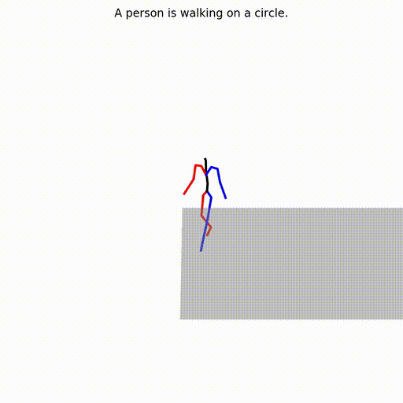

## MoGenTS: Motion Generation based on Spatial-Temporal Joint Modeling

This is the official PyTorch implementation code for MoGenTS. For technical details, please refer to:

**MoGenTS: Motion Generation based on Spatial-Temporal Joint Modeling** <br />
Weihao Yuan, Weichao Shen, Yisheng HE, Xiaodong Gu, Zilong Dong, Liefeng Bo, Qixing Huang <br />
**NeurIPS 2024** <br />
**[[Project Page](https://aigc3d.github.io/mogents/)]** | 
**[[Paper](https://arxiv.org/abs/2409.17686)]** <br />

<p float="left">
  &emsp;&emsp; 
</p>


## Bibtex
If you find this code useful in your research, please cite:

```
@inproceedings{yuan2024mogents,
    title={MoGenTS: Motion Generation based on Spatial-Temporal Joint Modeling},
    author={Weihao Yuan and Weichao Shen and Yisheng HE and Yuan Dong and Xiaodong Gu and Zilong Dong and Liefeng Bo and Qixing Huang},
    booktitle = {Neural Information Processing Systems (NeurIPS)},
    pages={},
    year={2024},
}
```


## Contents
1. [Environment](#environment)
2. [Dependencies](#dependencies)
3. [Demo](#demo)
4. [Training](#training)
5. [Evaluation](#evaluation)


## Environment

- Install Conda Environment
```
conda env create -f environment.yml
conda activate momask
pip install git+https://github.com/openai/CLIP.git
```

- Or Install with Pip Install
```
conda create -n mogents python=3.8
pip install torch==2.2.0 torchvision==0.17.0 torchaudio==2.2.0 --index-url https://download.pytorch.org/whl/cu118
pip install -r requirements.txt
```

## Dependencies

### 1. Download the pretrained models

Download the models and place at `./logs/humanml3d/`

| Model | FID |
| :--- | :---: |
|[HumanML3D](https://virutalbuy-public.oss-cn-hangzhou.aliyuncs.com/share/mogents/pretrain_models.zip) | 0.028 |
|[KIT-ML](https://virutalbuy-public.oss-cn-hangzhou.aliyuncs.com/share/mogents/pretrain_models_kit.zip) | 0.135 |

### 2. Evaluation Models and Gloves

- Follow previous [method](https://github.com/EricGuo5513/momask-codes?tab=readme-ov-file#2-models-and-dependencies) to prepare the evaluation models and gloves. Or directly download from [here](https://virutalbuy-public.oss-cn-hangzhou.aliyuncs.com/share/mogents/checkpoints.zip) and place to `./checkpoints`

### 3. Dataset (Only for training)

- **HumanML3D** - Follow the instruction in [HumanML3D](https://github.com/EricGuo5513/HumanML3D.git), then place the result dataset to `./dataset/HumanML3D`.

- **KIT** - Download from [HumanML3D](https://github.com/EricGuo5513/HumanML3D.git), then place the dataset in `./dataset/KIT-ML`


## Demo

<p float="left">
  &emsp;&emsp; 
</p>

```
python demo_mogen.py --gpu_id 0 --ext exp1 --text_prompt "A person is walking on a circle." --checkpoints_dir logs --dataset_name humanml3d --mtrans_name pretrain_mtrans --rtrans_name pretrain_rtrans
```

Some parameters explanation:
* `--repeat_times`: number of replications for generation, default `1`.
* `--motion_length`: specify the number of poses for generation.

Output explanation in `./outputs/exp1/`: 
* `numpy files`: generated motions with shape of (nframe, 22, 3), under subfolder `./joints`.
* `video files`: stick figure animation in mp4 format, under subfolder `./animation`.
* `bvh files`: bvh files of the generated motion, under subfolder `./animation`.

Then you can follow [MoMask](https://github.com/EricGuo5513/momask-codes?tab=readme-ov-file#dancers-visualization) to retarget the generated motion to other 3D characters for visualization.


## Training
1. Train the VQVAE
```
bash run_rvq.sh vq 0 humanml3d --batch_size 256 --num_quantizers 6 --max_epoch 50 --quantize_dropout_prob 0.2 --gamma 0.1 --code_dim2d 1024 --nb_code2d 256
```

2. Train the Mask Transformer
```
bash run_mtrans.sh mtrans 4 humanml3d --vq_name vq --batch_size 384 --max_epoch 2000 --attnj --attnt
```

3. Train the Residual Transformer
```
bash run_rtrans.sh rtrans 2 humanml3d --batch_size 64 --vq_name vq --cond_drop_prob 0.01 --share_weight --max_epoch 2000 --attnj --attnt
```

## Evaluation

1. Evaluate the VQVAE
```
python eval_vq.py --gpu_id 0 --name pretrain_vq --dataset_name humanml3d --ext eval --which_epoch net_best_fid.tar
```

2. Evaluate the Mask Transformer
```
python eval_mask.py --dataset_name humanml3d --mtrans_name pretrain_mtrans --gpu_id 0 --cond_scale 4 --time_steps 10 --ext eval --which_epoch fid
```

3. Evaluate Mask + Residual Transformer

**Humanml3D:**
```
python eval_res.py --gpu_id 0 --dataset_name humanml3d --mtrans_name pretrain_mtrans --rtrans_name pretrain_rtrans --cond_scale 4 --time_steps 10 --ext eval --which_ckpt net_best_fid.tar --which_epoch fid --traverse_res
```

**KIT-ML:**
```
python eval_res.py --gpu_id 0 --dataset_name kit --mtrans_name pretrain_mtrans_kit --rtrans_name pretrain_rtrans_kit --cond_scale 4 --time_steps 10 --ext eval --which_ckpt net_best_fid.tar --which_epoch fid --traverse_res
```

## Acknowledgements

We sincerely thank the open-sourcing of these excellent works where our code is based on:

[MoMask](https://github.com/EricGuo5513/momask-codes)

## License
This code is distributed under an MIT LICENSE.

Note that our code depends on other libraries, including SMPL, SMPL-X, PyTorch3D, and uses datasets which each have their own respective licenses that must also be followed.
